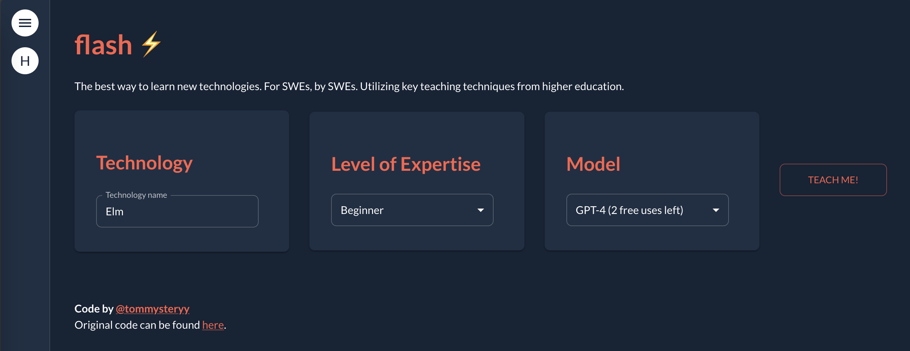

# flash ⚡️
The faster and proper way to learn new technologies, specifically designed for software engineers. Power by [`flash-agent`](https://github.com/xoo-creative/flash-agent/tree/main), a parallelized, multi-agent AWS Lambda built with [LangChain](https://github.com/langchain-ai/langchain). Currently in `beta`.

## What is `flash` for?

[Software engineers need to learn new technologies constantly](https://www.reddit.com/r/AskEngineers/comments/t8qo2v/do_you_constantly_have_to_learn_new_stuff_as_a/). Given that there are [literally millions of libraries in various programming languages](https://www.codingem.com/what-is-a-library/) (this doesn't even count technologies and frameworks), and new things being released almost everyday, we spend **a lot** of our time trying to learn and apply new tools.

But I found that many professional software engineers I worked with have a "brute-force" approach to learning:

1. Read the documentation
2. Find some examples on Stack overflow or Medium
3. Try some code locally 
4. Repeat until (you think) you understand enough of it for your use

<!-- Not only is this an inefficient way of learning, it also does not work for engineers newer to the field, since this approach **relies** on parsing dense, technical documentation and "filling in the gaps" yourself. How could I learn a python package this way if I don't even know how to `pip install`? -->

Having extensive teaching experience in university-level computer science and data science courses, I **know** we can do better. I condensed that knowledge into `flash` - the better way to learn technologies on the job and accelerate your professional growth!

## How does it work?

Navigate to [`flash`](https://tommysteryy-flash-b4977b4fbac5.herokuapp.com/). Type in a new technology that you're trying to wrap your head around, and let our platform handle the rest. 

We'll generate a short (< 3 min) read that will teach you everything you need to know, including:

- Context about why this technology exists
- Why it's popular/useful
- Key concepts
- Common usecases
- A self-contained and practical code example to get you started.
  
## Demo

<video controls>
<source src="./static/flash-demo.mov" type="video/mp4">
</video>

## More Examples

Another way to see how `flash` can help is is to check out our text-based examples. These were generated the same way, just saved and displayed statically here. Obviously, `flash` would be most useful if you had not used this technology before, but that is not required.

- Beginner: [Git](./flash/text-examples/git/)
- Intermediate: [Docker](./flash/text-examples/docker/)
- Intermediate-Advanced: [Elm](./flash/text-examples/elm/)
- ... More to come!